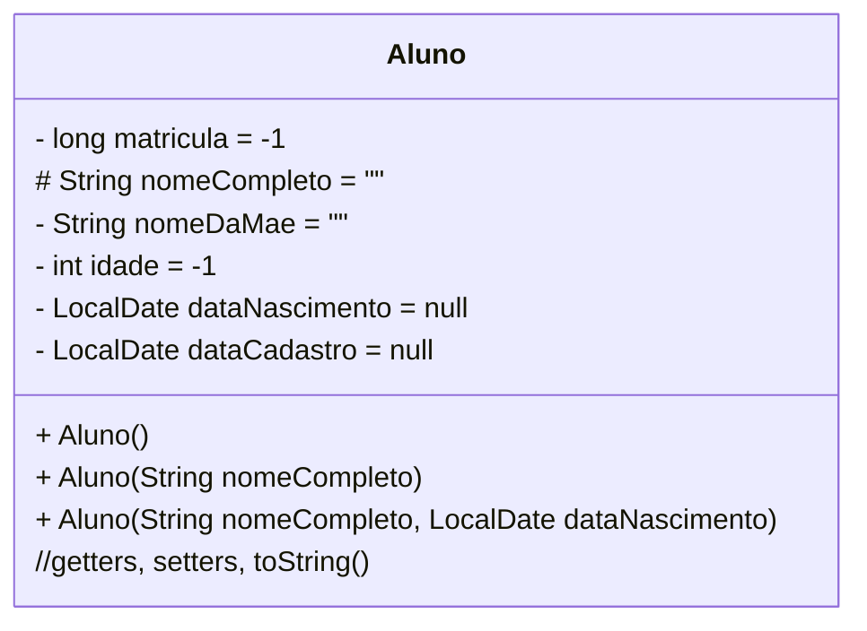

### U1 - Aula 2 - 16/05/2025 - Tipos Primitivos e Classes (2,0)

### 1. Considerações sobre OO e tipos primitivos:

- **Orientação a Objetos**: é um jeito diferente de programar.
  Resumo do paradigma: modelar software como um conjunto de objetos que possuem estado (atributos) e comportamento (métodos).
  Outros paradigmas: imperativo, procedural, funcional, lógico, declarativo, reativo.

- **Tipos Primitivos**: tipos de dados básicos fornecidos pela linguagem Java para armazenar valores simples. São armazenados diretamente na memória (_stack_) e têm um tamanho fixo. Não são objetos, portanto, não possuem métodos associados. Ascomparações são feitas com operadores ==,<, >. Os limites [são esses](tiposPrimitivos.png).

- **Classes (String, Integer)**: Em Java, classes são "moldes" para objetos. Um objeto é uma instância de uma classe. As variáveis que são instâncias de classes são referências aos objetos armazenados na memória (_heap_). Classes podem ter métodos e atributos associados. Usa-se o método .equals(). Usar == compara referências de memória.

- **String** é uma classe _muito_ especial usada para representar [sequências de caracteres](stringEmJava.png)

- **GUI**: Posso usar IA para gerar interface gráfica [GUI - Graphical User Interface](exemplos_gui).

- **Diagrama de Classes**:

### 2. Exercícios em Sala

### a. Finalizar o exercício da Aula 1.

### b. Fazer o exercício da Aula 2.

Gabaritos para ajudar no exercícios [aqui](gabaritos).

Após concluir cada questão, faça _commit_ localmente e sincronize-o (_push_) com o seu repositório remoto no GitHub. Conforme [figura](https://drive.google.com/open?id=1dV5TwUdMxSmh80sx13epVcJFewIT_MVk).

Entregue a folha assinada!
