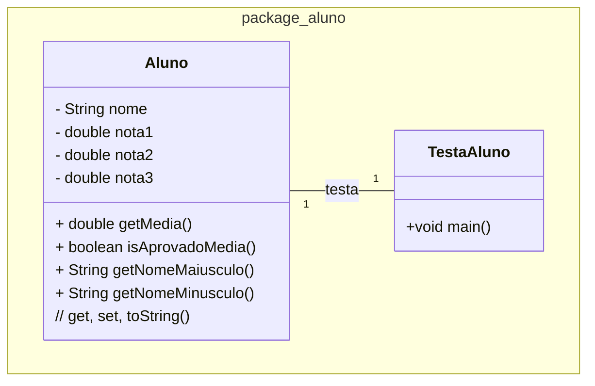

### U1 - Aula 3 - 05/12/2024 - Classe, objeto, método, atributo (2,0)

1. Considerações sobre tipos primitivos e Classes:

- Tipos Primitivos: tipos de dados básicos fornecidos pela linguagem Java para armazenar valores simples. São armazenados diretamente na memória (_stack_) e têm um tamanho fixo. Não são objetos, portanto, não possuem métodos associados. Ascomparações são feitas com operadores ==,<, >. Os limites [são esses](tiposPrimitivos.png).

- Classes (String, Integer): Em Java, classes são "moldes" para objetos. Um objeto é uma instância de uma classe. As variáveis que são instâncias de classes são referências aos objetos armazenados na memória (_heap_). Classes podem ter métodos e atributos associados. Usa-se o método .equals(). Usar == compara referências de memória.

- String é uma classe _muito_ especial usada para representar [sequências de caracteres](stringEmJava.png)

### Exercícios Resolvidos

1. Programação Estruturada - Cálculo de Média: Crie um programa em Java que calcule a média de três notas utilizando programação estruturada. Não use classes ou objetos para isso.

2. Programação O.O. - Aluno com Cálculo de Média: Crie uma classe ```Aluno``` que tenha os atributos nome e três notas. Implemente métodos para calcular a média das notas e para verificar se o aluno foi aprovado (média maior ou igual a 7.0) ou reprovado. Implemente métodos para exibir o nome do aluno em letras maiúsculas e minúsculas. Crie uma classe TestaAluno para instanciar um aluno e exibir suas informações, incluindo a média e o status de aprovação. Implemente/gere automagicamente getters, setters e toString. Crie a classe TestaAluno, com 2 alunos.



### Exercícios em Sala

Após concluir cada questão, faça _commit_ localmente e sincronize-o (_push_) com o seu repositório remoto no GitHub. Conforme [figura](https://drive.google.com/open?id=1dV5TwUdMxSmh80sx13epVcJFewIT_MVk).

Gabaritos para ajudar no exercícios [aqui](gabaritos).

Entregue a folha assinada!