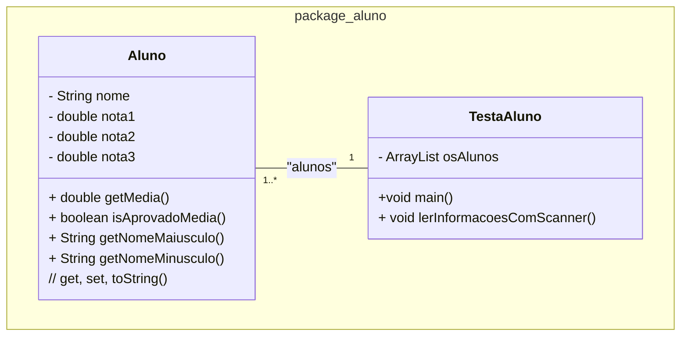

### U2 - Aula 4 - 06/12/2024 - Lista ligada, datas, Scanner (1,0)

Leitura em sala - [Seção 4.3 daqui](https://engsoftmoderna.info/cap4.html)

### Exercícios Resolvidos

1. Lista de Alunos e Scanner: Crie uma classe ```Aluno``` que tenha os atributos nome e três notas. Implemente métodos para calcular a média das notas e para verificar se o aluno foi aprovado (média maior ou igual a 7.0) ou reprovado. Adicione métodos para exibir o nome do aluno em letras maiúsculas e minúsculas. Implemente/gere automagicamente getters, setters e toString. Crie uma classe ```TestaAluno``` para instanciar 5 alunos, cujas informações devem ser lidas do usuário via **Scanner**, armazenadas em um **ArrayList** e exibidas posteriormente com o nome, média e status de aprovação de cada aluno. 




### Exercícios em Sala

Após concluir cada questão, faça _commit_ localmente e sincronize-o (_push_) com o seu repositório remoto no GitHub. Conforme [figura](https://drive.google.com/open?id=1dV5TwUdMxSmh80sx13epVcJFewIT_MVk).

Gabaritos para ajudar no exercícios [aqui](../unidade2/).

Entregue a folha assinada!
