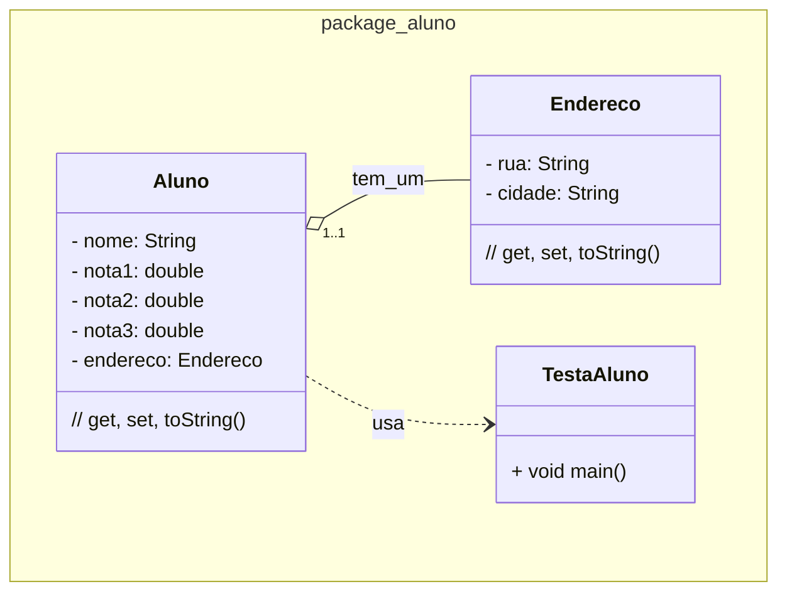

### U2 - Aula 7 - 19/12/2024 - Visibilidade, Composição (3,0)

### Exercício Resolvido

1. Crie uma classe `Aluno` que tenha os atributos nome e três notas. Crie a classe Endereço, com Rua e Cidade. Cada aluno tem apenas 1 endereço. Componha as classes e teste na classe `TestaAluno`. 

### Exercícios em Sala

Gabaritos para ajudar no exercícios [aqui](../unidade2_aula7/).

Faça _commit_ e _push_. Entregue a folha assinada!
