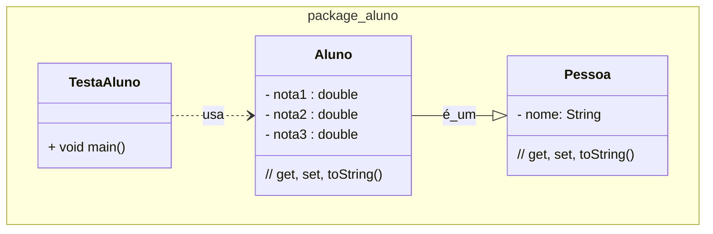

### U3 - Aula 8 - 20/12/2024 - Herança, Polimorfismo, Exceptions (5,0)

### Exercício Resolvido

1. Crie uma classe `Pessoa` que tenha o atributo nome. Crie uma classe `Aluno` que herda de `Pessoa` e tem três notas. Crie a classe `NotaInvalidaException`. Use todas as classes em `TestaPessoa` e `TestaAluno`.

### Exercícios em Sala

Gabaritos para ajudar no exercícios [aqui](../unidade3_aula8/).

Faça _commit_ e _push_. Entregue a folha assinada!
