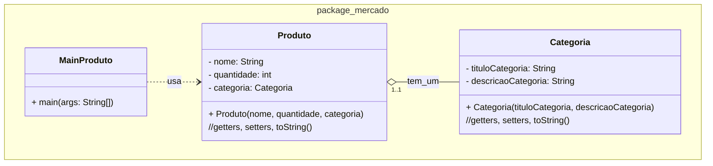

### U2 - Aula 7 - 19/12/2024 - Visibilidade, Composição (3,0)

#### 1. (3,0) Produtos e Categoria

Implemente em Java as classes a seguir. Salve em unidade2/...



Método main na classe MainProduto.java

```java
public class MainProduto {
    public static void main(String[] args) {

        Categoria categoriaAlimento = new Categoria("Alimento", "Produtos alimentícios");

        Produto produto = new Produto("Arroz", 100, categoriaAlimento);

        System.out.println(produto);
    }
}
```
