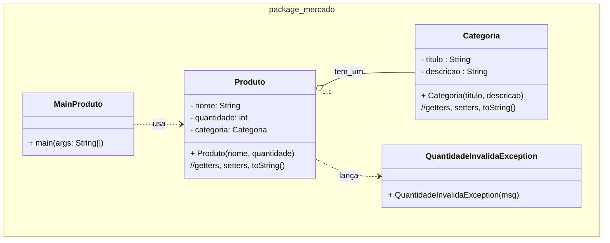

### U3 - Aula 8 - 20/12/2024 - Herança, Polimorfismo, Exceptions (5,0)

#### 1. (5,0) Produtos e Exception

Modifique as classes da aula anterior. Modifique o main. Crie a nova classe ```QuantidadeInvalidaException```. Salve em unidade3/...



Método main na classe MainProduto.java

```java
public class MainProduto {
    public static void main(String[] args) {
        try {
            Categoria categoriaAlimento = new Categoria("Alimento", "Produtos alimentícios");

            Produto produto = new Produto("Arroz", -10, categoriaAlimento);

            System.out.println(produto);
        } catch (QuantidadeInvalidaException e) {
            System.out.println("Erro: " + e.getMessage());
        }
    }
}
```