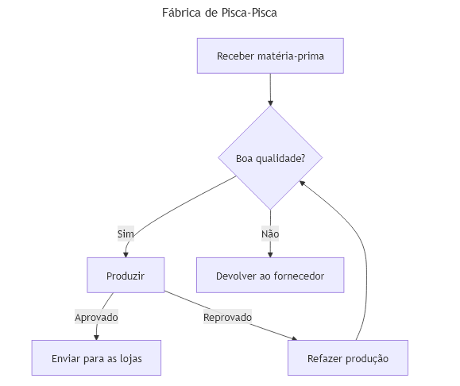

## Programação de Computadores - Unidade 1 - Exercício 2

#### (1,0) Imitando um Fluxograma

1. Crie o arquivo `unidade1/exercicio2_1.mmd` com o fluxograma descrito a seguir, usando a [documentação oficial](https://mermaid.js.org/syntax/flowchart.html) e o [editor Mermaid](https://mermaid.live/).

Para entender a sintaxe e se habituar com o Mermaid, imite o seguinte fluxograma que modela de forma simplificada uma fábrida de pisca-pisca de Natal:

---

#### (1,0) Modelagem com Fluxograma

2. Crie o arquivo `unidade1/exercicio2_2.mmd`, que deve conter o fluxograma representando o processo da **fábrica de calçados**, conforme descrito a seguir.

   - **Fornecedor**: Envia matéria-prima.
   - **Armazém**: Recebe, registra e controla o estoque de matéria-prima.
   - **Linha de Produção**: Realiza a fabricação dos calçados.
   - **Controle de Qualidade**: Avalia a conformidade dos calçados acabados.
   - **Setor de Embalagem**: Embala os calçados acabados.
   - **Expedição**: Organiza a saída dos calçados e emite notas fiscais.
   - **Clientes**: Recebem os calçados.
   - **Financeiro**: Gerencia os custos de produção e a receita gerada.

---

Quando finalizar, faça o commit e push para o seu repositório, conforme [figura](https://drive.google.com/open?id=1dV5TwUdMxSmh80sx13epVcJFewIT_MVk).