## Engenharia de Produção - Unidade 1 - Exercício 1

#### 1. (2,0) **Gestão de Produção e Controle de Estoque**

1. Crie o arquivo `unidade1/exercicio3.mmd` com o fluxograma para a modelagem apresentada a seguir, usando a [documentação oficial](https://mermaid.js.org/syntax/flowchart.html) e o [editor Mermaid](https://mermaid.live/). Esse seria um sistema para gerenciar a produção e o controle de estoque de uma fábrica. O sistema permite o cadastro de produtos, o registro de lotes de produção e o controle das entradas e saídas de estoque.

A modelagem inicial incluiu as seguintes entidades:

1. **Produto**: Esta classe deve representar os produtos da fábrica. Cada produto tem um código único, um nome, uma quantidade mínima de estoque e uma quantidade atual no estoque. A classe deve ter os seguintes métodos:
   - `adicionarAoEstoque(int quantidade)`: adiciona a quantidade especificada ao estoque.
   - `removerDoEstoque(int quantidade)`: remove a quantidade especificada do estoque.
   - `verificarEstoqueMinimo()`: verifica se a quantidade atual do produto é inferior à quantidade mínima definida para o produto.

2. **Lote**: Cada lote representa uma produção de um determinado produto. Um lote tem um número de identificação, uma data de produção e a quantidade de produtos produzidos. A classe deve ter os seguintes métodos:
   - `registrarLote()`: registra o lote e atualiza o estoque do produto correspondente.
   - `adicionarProdutoAoEstoque()`: adiciona a quantidade produzida ao estoque do produto.

3. **Estoque**: Representa o estoque da fábrica, contendo uma lista de objetos `Produto`. Os métodos são:
   - `adicionarProduto(Produto produto)`: adiciona um produto ao estoque.
   - `removerProduto(String codigo, int quantidade)`: remove uma quantidade específica de um produto do estoque, dado o código.
   - `verificarEstoqueProduto(String codigo)`: retorna a quantidade atual de um produto no estoque, dado o código do produto.

5. **Relatórios**: O sistema deve permitir gerar relatórios sobre os produtos com estoque baixo (abaixo da quantidade mínima) e relatórios sobre os lotes produzidos.

4. **Main**: Implementar a classe `Main` com um método `main` que simula as operações de um sistema de controle de produção e estoque. A classe `Main` deve permitir:
   - Cadastrar novos produtos.
   - Registrar novos lotes de produção.
   - Atualizar o estoque com os produtos produzidos.
   - Registrar a saída de produtos para pedidos.
   
---

### Considerações

1. **Modelagem**: Utilize o diagrama de classes fornecido como guia.
   
2. **Diagrama de Classes**: O diagrama de classes apresentado foi criado para ajudar:

```mermaid
classDiagram
    class Produto {
        - codigo: String
        - nome: String
        - quantidadeMinimaEstoque: int
        - quantidadeEmEstoque: int
        + adicionarEstoque(quantidade: int): void
        + removerEstoque(quantidade: int): void
        + verificarEstoqueMinimo(): boolean
    }

    class Lote {
        - numeroLote: String
        - dataProducao: LocalDateTime
        - produto: Produto
        - quantidadeProduzida: int
        + registrarLote(): void
        + adicionarProdutoAoEstoque(): void
    }

    class Estoque {
        - produtos: List<Produto>
        + adicionarProduto(produto: Produto): void
        + removerProduto(codigo: String, quantidade: int): void
        + verificarEstoqueProduto(codigo: String): int
    }

    class Main {
        + main(args: String[]): void
    }

    Produto "1" -- "0..*" Lote : gerencia
    Produto "1" -- "0..1" Estoque : pertence
    Estoque "1" -- "0..*" Produto : contém
    Main "1" --> "1" Estoque : usa

```

Quando finalizar, faça o commit e push para o seu repositório, conforme [figura](https://drive.google.com/open?id=1dV5TwUdMxSmh80sx13epVcJFewIT_MVk).
