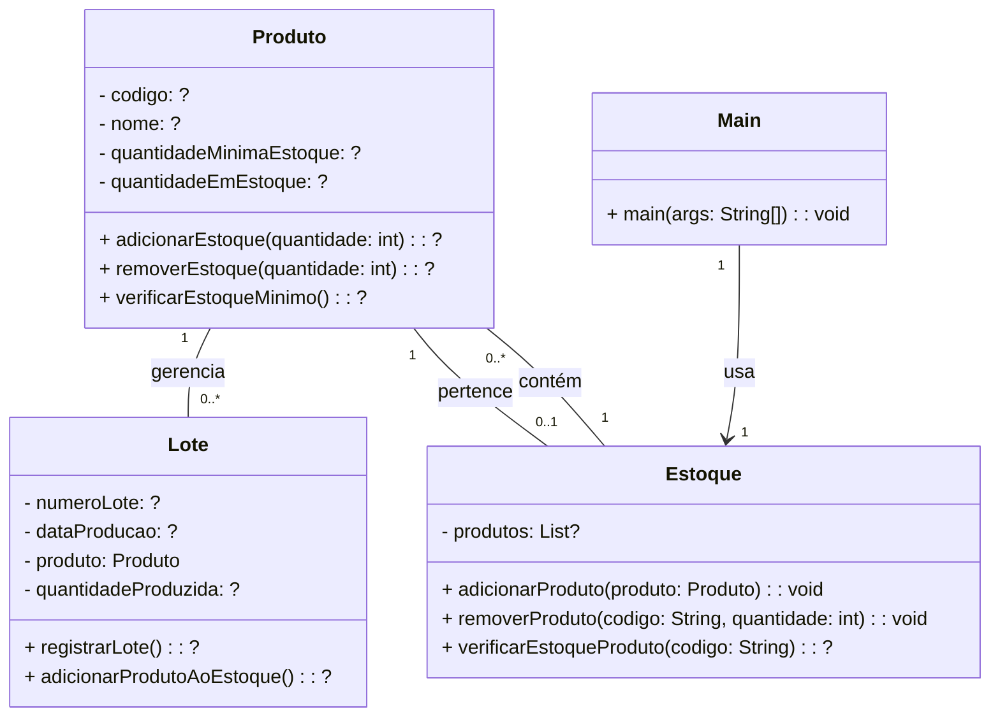

## Programação de Computadores - Unidade 2 - Exercício 1

#### 1. (2,0) **Gestão de Produção e Controle de Estoque**

#### Modelagem
Considere um sistema para gerenciar a produção e o controle de estoque de uma fábrica. O sistema permite o cadastro de produtos, o registro de lotes de produção e o controle das entradas e saídas de estoque. A modelagem inicial incluiu as seguintes entidades, num diagrama de Classes:

#### (1,0) - Questão 1 - Tipos de Dados

Crie o arquivo `unidade1/exercicio3_1.mmd` com o diagrama de classes representando o sistema proposto (clique em "Raw" no canto superior direito). Sugira os tipos de dados adequados para cada atributo. [Esses exemplos](gabaritosAula3) podem ajudar. Use também a [documentação oficial](https://mermaid.js.org/syntax/flowchart.html) e o [editor online Mermaid](https://mermaid.live/). 

#### (1,0) - Questão 2 - Diagrama de Sequencia

Crie o arquivo `unidade1/exercicio3_2.mmd` com um diagrama de sequencia que detalha o cadastro de novos produtos e lotes.
    
Quando finalizar, faça o commit e push para o seu repositório, conforme [figura](https://drive.google.com/open?id=1dV5TwUdMxSmh80sx13epVcJFewIT_MVk).
